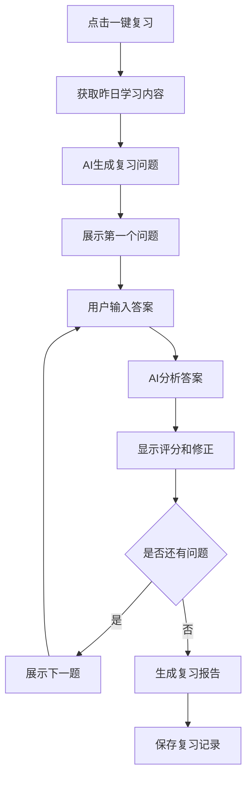

# 一键复习功能设计文档

## 功能概述

一键复习功能是学习计划系统的重要组成部分，旨在通过AI智能问答的方式，帮助用户快速回顾和巩固昨日学习内容，形成有效的学习闭环。

## 功能背景

### 痛点分析
1. **复习效率低**：传统复习方式缺乏针对性，用户难以快速定位重点
2. **知识点遗忘**：缺乏及时的回顾机制，导致学习效果递减
3. **自我检验难**：用户难以客观评估自己的掌握程度
4. **复习无序**：没有系统的复习方案，容易遗漏重要知识点

### 解决方案
通过AI驱动的智能复习问答系统，基于用户昨日学习内容自动生成针对性问题，并在用户回答后提供专业的修正和补充，实现高效的知识巩固。

## 核心功能设计

### 1. 功能入口
- **学习计划页面**：在每日学习计划中显示"一键复习昨日内容"按钮
- **AI问答页面**：增加"复习模式"入口
- **首页快捷操作**：在用户登录后显示复习提醒

### 2. 复习内容获取
```javascript
// 获取昨日学习内容的逻辑
const getYesterdayStudyContent = () => {
  // 从用户学习记录中获取昨日完成的任务
  // 包括：学习的科目、专题、重点知识点、学习时长等
  return {
    date: '2025-06-22',
    subjects: ['民法'],
    topics: ['物权变动', '善意取得', '物权保护'],
    keyPoints: [
      '物权变动的公示公信原则',
      '善意取得的构成要件',
      '物权请求权的行使'
    ],
    studyDuration: '3.5小时',
    completedTasks: [
      '民法物权编视频学习(2小时)',
      '物权变动真题练习(40题)',
      '知识导图复习(30分钟)'
    ]
  }
}
```

### 3. AI问题生成策略

#### 3.1 问题类型分级
1. **基础概念题**（30%）：测试基本概念理解
2. **法条应用题**（40%）：考查法条的具体适用
3. **案例分析题**（30%）：检验综合运用能力

#### 3.2 问题生成模板
```markdown
基于昨日学习内容：{科目} - {专题}
学习时长：{时长}
重点知识点：{知识点列表}

请生成5-8个复习问题，要求：
1. 涵盖昨日学习的所有重点知识点
2. 题型分布：概念题2-3个，法条题3个，案例题2-3个
3. 难度递进：从基础概念到综合应用
4. 紧密结合法考真题风格
5. 每题都要有明确的考查目标

示例问题格式：
【概念题】请解释"善意取得"的含义及其在物权法中的作用？
【法条题】根据《民法典》相关规定，善意取得需要满足哪些构成要件？
【案例题】甲将其汽车借给乙使用，乙私自将车卖给不知情的丙，并办理了过户手续。请分析丙是否能够取得汽车所有权？
```

### 4. 用户交互流程

#### 4.1 复习流程图


#### 4.2 界面设计要求
1. **问题展示区**：清晰显示当前问题，支持法条引用和案例描述
2. **答案输入区**：支持富文本输入，便于用户组织答案结构
3. **进度指示器**：显示当前是第几题/总题数
4. **时间记录**：记录每题的答题时间
5. **跳过/标记功能**：允许用户跳过或标记难题

### 5. AI评估与修正机制

#### 5.1 答案评估标准
```markdown
# AI答案评估Prompt

你是专业的法考辅导老师，请根据以下标准评估学生的答案：

## 评估维度
1. **概念准确性**（30分）：基本概念理解是否正确
2. **法条掌握度**（25分）：相关法条引用是否准确
3. **逻辑性**（25分）：论证过程是否清晰有序
4. **完整性**（20分）：答案要点是否全面

## 评分等级
- A级（90-100分）：掌握优秀，答案完整准确
- B级（80-89分）：掌握良好，有小瑕疵
- C级（70-79分）：基本掌握，有明显不足
- D级（60-69分）：掌握不足，需重点复习
- E级（60分以下）：未掌握，需重新学习

## 反馈格式
**评分：** X级（XX分）
**正确要点：** [学生答对的部分]
**需要补充：** [遗漏的重要内容]
**错误纠正：** [如有错误，详细纠正]
**深入理解：** [相关的深层次知识点]
**真题关联：** [与历年真题的联系]

学生答案：{用户输入的答案}
标准答案：{标准答案}
```

#### 5.2 个性化修正策略
- **概念薄弱型**：加强基础概念的解释和记忆技巧
- **法条生疏型**：提供法条背景和实际应用场景
- **逻辑混乱型**：指导答题思路和结构化表达
- **知识面窄型**：拓展相关知识点和案例

### 6. 复习报告生成

#### 6.1 报告内容结构
```markdown
# 昨日内容复习报告

## 📊 复习概况
- 复习日期：{日期}
- 复习科目：{科目列表}
- 复习用时：{总用时}
- 完成题数：{完成数/总题数}

## 📈 掌握情况分析
### 整体评分：{平均分}（{等级}）
- A级题目：{数量}题 - 掌握优秀 ✅
- B级题目：{数量}题 - 掌握良好 ⭐
- C级题目：{数量}题 - 基本掌握 ⚠️
- D级及以下：{数量}题 - 需要加强 ❌

## 🎯 知识点掌握分析
| 知识点 | 掌握程度 | 建议 |
|--------|----------|------|
| 物权变动 | A级 | 继续保持 |
| 善意取得 | C级 | 需要重点复习构成要件 |
| 物权保护 | B级 | 加强案例练习 |

## 📚 后续学习建议
1. **优先复习**：{需要重点关注的知识点}
2. **强化练习**：{建议的练习方向}
3. **拓展学习**：{相关的深入内容}

## 🔄 下次复习安排
建议在{X}天后再次复习今日的薄弱知识点
```

### 7. 技术实现要点

#### 7.1 数据存储结构
```sql
-- 复习记录表
CREATE TABLE review_sessions (
  id INT PRIMARY KEY AUTO_INCREMENT,
  user_id VARCHAR(50),
  review_date DATE,
  study_date DATE, -- 被复习的学习日期
  subjects JSON, -- 复习的科目
  total_questions INT,
  completed_questions INT,
  average_score DECIMAL(5,2),
  total_duration INT, -- 复习用时（分钟）
  created_at TIMESTAMP DEFAULT CURRENT_TIMESTAMP
);

-- 复习问题记录表
CREATE TABLE review_questions (
  id INT PRIMARY KEY AUTO_INCREMENT,
  session_id INT,
  question_text TEXT,
  question_type ENUM('concept', 'law', 'case'),
  user_answer TEXT,
  ai_feedback TEXT,
  score INT,
  answer_time INT, -- 答题用时（秒）
  created_at TIMESTAMP DEFAULT CURRENT_TIMESTAMP
);
```

#### 7.2 API接口设计
```typescript
// 获取复习内容
GET /api/review/content?date=2025-06-22
Response: {
  studyContent: StudyContent,
  questions: Question[],
  estimatedTime: number
}

// 提交答案
POST /api/review/answer
Body: {
  sessionId: string,
  questionId: string,
  answer: string,
  answerTime: number
}
Response: {
  feedback: AIFeedback,
  score: number,
  nextQuestion?: Question
}

// 完成复习
POST /api/review/complete
Body: {
  sessionId: string
}
Response: {
  report: ReviewReport,
  recommendations: string[]
}
```

### 8. 用户体验优化

#### 8.1 智能提醒机制
- **最佳复习时间**：根据记忆曲线，在学习后18-24小时提醒复习
- **个性化提醒**：根据用户的活跃时间段发送提醒
- **渐进式提醒**：从轻度提醒到重要提醒，避免打扰

#### 8.2 激励机制
- **连续复习天数**：统计并显示连续复习天数
- **掌握度提升**：可视化展示知识点掌握度的提升曲线
- **复习成就**：设置复习里程碑和成就徽章

### 9. 功能扩展规划

#### 9.1 阶段性复习
- **周复习**：每周日自动生成本周重点内容复习
- **月复习**：每月进行系统性知识点复习
- **考前复习**：临近考试时的集中复习模式

#### 9.2 协作复习
- **学习小组**：支持多人协作复习和讨论
- **错题共享**：分享和讨论常见错题
- **复习PK**：与其他用户进行复习效果比拼

## 实施计划

### 第一阶段（核心功能）
- [ ] 昨日学习内容获取逻辑
- [ ] AI问题生成系统
- [ ] 基础问答界面
- [ ] 答案评估和反馈机制

### 第二阶段（体验优化）
- [ ] 复习报告生成
- [ ] 智能提醒系统
- [ ] 数据统计和分析
- [ ] 界面美化和交互优化

### 第三阶段（功能扩展）
- [ ] 阶段性复习功能
- [ ] 个性化推荐算法
- [ ] 社交复习功能
- [ ] 深度数据分析

## 成功指标

1. **使用率**：日活用户的复习功能使用率达到60%以上
2. **完成率**：开始复习的用户完成率达到80%以上
3. **效果提升**：复习后相关知识点测试成绩提升20%以上
4. **用户满意度**：功能满意度评分达到4.5分以上（5分制）

---

> **注意事项**  
> 1. AI评估需要持续优化，建立反馈机制不断改进评估准确性
> 2. 复习内容要与学习计划紧密结合，形成完整的学习闭环
> 3. 注意保护用户学习数据隐私，确保数据安全
> 4. 预留扩展接口，为后续功能升级做好准备