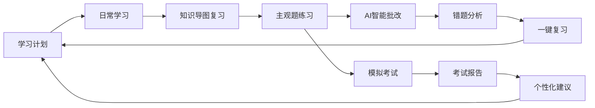

# 主观题智能批改功能设计文档

## 功能概述

主观题智能批改功能是基于AI技术的法考主观题模拟考试和智能评分系统，旨在帮助用户通过仿真的考试环境练习主观题答题技巧，并获得专业的AI批改反馈，提升主观题应试能力。

## 功能背景

### 法考主观题特点分析
1. **占分比重大**：主观题满分180分，占总分37.5%，是法考通过的关键
2. **答题要求高**：需要"法条+案例分析"的综合运用能力
3. **评分标准严**：按照"要件-法条-结论"的逻辑链条评分
4. **练习机会少**：传统培训中主观题练习和批改机会有限

### 核心价值
- **真实模拟**：提供接近真实考试的答题环境和题目质量
- **智能评分**：基于法考评分标准的AI批改系统
- **个性化指导**：针对用户答题薄弱环节提供专业建议
- **高效训练**：大量优质题目库支持反复练习

## 基于法考八大学科的题库设计

### 1. 题库结构（基于law-subjective-outline-8.md）

#### 1.1 民法主观题（35%，约63题）
```markdown
## 民法主观题分类

### 第一编 总则（8题）
- 民事主体能力案例（2题）
- 代理关系认定分析（2题）
- 诉讼时效适用（2题）
- 法律行为效力（2题）

### 第二编 物权（15题）
- 物权变动与公示（4题）
- 所有权与共有纠纷（4题）
- 用益物权设立与保护（3题）
- 担保物权实现（4题）

### 第三编 合同（20题）
- 合同订立与效力（5题）
- 合同履行与违约（5题）
- 典型合同争议（买卖、租赁、借款等）（7题）
- 无因管理与不当得利（3题）

### 第四-七编 其他（20题）
- 人格权保护（3题）
- 婚姻家庭纠纷（5题）
- 继承纠纷（4题）
- 侵权责任认定（8题）
```

#### 1.2 刑法主观题（25%，约45题）
```markdown
## 刑法主观题分类

### 第一编 总则（20题）
- 犯罪构成要件分析（8题）
- 犯罪未完成形态（4题）
- 共同犯罪认定（4题）
- 罪数与量刑（4题）

### 第二编 分则（25题）
- 危害公共安全罪（5题）
- 侵犯人身权利罪（6题）
- 侵犯财产罪（6题）
- 妨害社会管理秩序罪（4题）
- 贪污贿赂罪（4题）
```

#### 1.3 三大诉讼法主观题（25%，约45题）
```markdown
## 诉讼法主观题分类

### 民事诉讼法（15题）
- 管辖权确定（3题）
- 证据认定与举证责任（4题）
- 诉讼程序适用（4题）
- 执行程序（4题）

### 刑事诉讼法（15题）
- 强制措施适用（4题）
- 证据收集与认定（4题）
- 审判程序（4题）
- 特别程序（3题）

### 行政法与行政诉讼法（15题）
- 行政行为效力（4题）
- 行政复议程序（3题）
- 行政诉讼受案范围（4题）
- 行政责任认定（4题）
```

#### 1.4 商经知主观题（10%，约18题）
```markdown
## 商经知主观题分类

### 商事法（8题）
- 公司设立与治理（3题）
- 合伙企业纠纷（2题）
- 破产程序（3题）

### 经济法（6题）
- 反垄断与反不正当竞争（2题）
- 证券与金融监管（2题）
- 劳动争议（2题）

### 知识产权法（4题）
- 专利权纠纷（1题）
- 商标权纠纷（1题）
- 著作权纠纷（2题）
```

#### 1.5 三国法主观题（3%，约5题）
#### 1.6 理论法主观题（2%，约4题）

### 2. 题目质量标准

#### 2.1 题目来源
- **历年真题改编**：基于2018-2024年法考真题进行变形和扩展
- **经典教学案例**：来自权威教材和培训机构的经典案例
- **热点法律问题**：结合最新法律法规和司法解释
- **原创模拟题**：AI辅助生成的高质量原创题目

#### 2.2 题目格式标准
```markdown
### 题目示例：民法-物权变动案例

**【题目背景】**
甲公司因资金周转困难，将其名下的一台价值50万元的机器设备抵押给乙银行，并办理了抵押登记。后甲公司未经乙银行同意，将该设备出售给不知情的丙公司，并实际交付。丙公司支付了全部价款。一个月后，甲公司到期无法偿还银行贷款。

**【问题设置】**
1. 甲公司向丙公司出售已抵押设备的行为性质如何？（15分）
2. 乙银行的抵押权是否有效？能否对抗丙公司？（20分）
3. 各方当事人的权利义务关系如何？（15分）

**【考查要点】**
- 抵押权的设立与公示
- 抵押财产的处分限制
- 善意取得与抵押权的冲突
- 物权优先效力原则

**【参考答案】**
[详细的标准答案，包含法条引用和分析逻辑]

**【评分细则】**
[按要点分配的详细评分标准]
```

## 智能批改系统设计

### 3. AI批改核心算法

#### 3.1 答案解析引擎
```python
class AnswerAnalysisEngine:
    def __init__(self):
        self.legal_knowledge_base = LegalKnowledgeBase()
        self.scoring_model = ScoringModel()
        
    def analyze_answer(self, question, user_answer):
        """
        分析用户答案的核心方法
        """
        # 1. 结构化分析
        structure_score = self.analyze_structure(user_answer)
        
        # 2. 法条引用分析
        legal_citation_score = self.analyze_legal_citations(user_answer, question.legal_basis)
        
        # 3. 逻辑推理分析
        logic_score = self.analyze_logical_reasoning(user_answer, question.key_points)
        
        # 4. 完整性分析
        completeness_score = self.analyze_completeness(user_answer, question.required_elements)
        
        # 5. 语言表达分析
        expression_score = self.analyze_expression(user_answer)
        
        return ScoringResult(
            structure_score=structure_score,
            legal_citation_score=legal_citation_score,
            logic_score=logic_score,
            completeness_score=completeness_score,
            expression_score=expression_score
        )
```

#### 3.2 评分标准体系
```markdown
## 主观题评分标准（总分50分制）

### 1. 答题结构（10分）
- **优秀（9-10分）**：层次清晰，逻辑严密，使用正确的法律术语
- **良好（7-8分）**：结构基本合理，逻辑关系明确
- **一般（5-6分）**：结构略显混乱，但基本可读
- **较差（3-4分）**：结构混乱，逻辑不清
- **很差（0-2分）**：无明显结构，难以理解

### 2. 法条运用（15分）
- **准确引用相关法条**（5分）：条文序号、内容准确
- **法条适用正确**（5分）：法条与案例事实对应恰当
- **法条解释到位**（5分）：能够解释法条的适用条件和效果

### 3. 案例分析（15分）
- **事实认定准确**（5分）：正确提取案例关键事实
- **法律关系梳理**（5分）：准确识别当事人间的法律关系
- **争议焦点把握**（5分）：正确识别案例的争议核心

### 4. 推理论证（8分）
- **逻辑推理严密**（4分）：从事实到结论的推理过程清晰
- **论证充分有力**（4分）：论据充分，说服力强

### 5. 语言表达（2分）
- **专业术语使用准确**（1分）
- **语言表达流畅清晰**（1分）
```

#### 3.3 智能批改Prompt设计
```markdown
# 法考主观题智能批改Prompt

你是一名资深的法考阅卷专家，具有10年以上的法考阅卷经验。请按照以下标准严格批改这道主观题。

## 题目信息
**科目：** {subject}
**题型：** {question_type}  
**分值：** {total_score}分
**考查要点：** {key_points}
**参考答案：** {reference_answer}

## 学生答案
{user_answer}

## 批改要求

### 1. 评分维度（请严格按照权重评分）
- **答题结构**（20%）：层次是否清晰，逻辑是否严密
- **法条运用**（30%）：法条引用是否准确，适用是否正确
- **案例分析**（30%）：事实认定和法律关系梳理是否准确
- **推理论证**（16%）：论证过程是否严密，结论是否正确
- **语言表达**（4%）：专业术语使用和表达是否规范

### 2. 批改输出格式

**📊 评分结果**
- 总分：{X}/{total_score}分
- 等级：{优秀/良好/一般/较差}
- 分项得分：
  - 答题结构：{X}分 ({比例}%)
  - 法条运用：{X}分 ({比例}%)  
  - 案例分析：{X}分 ({比例}%)
  - 推理论证：{X}分 ({比例}%)
  - 语言表达：{X}分 ({比例}%)

**✅ 答题亮点**
- [具体指出学生答案中的优秀之处]
- [肯定正确的法条引用和分析]

**❌ 主要问题**
- [指出答案中的关键错误或遗漏]
- [分析逻辑漏洞或法条适用错误]

**💡 改进建议**
- [针对薄弱环节的具体改进建议]
- [推荐相关法条和案例学习]

**📚 知识拓展**
- [相关的重要知识点补充]
- [类似案例的处理思路]

### 3. 特别要求
1. 评分要客观公正，严格按照法考标准
2. 指出的问题要具体，不能泛泛而谈
3. 改进建议要有针对性和可操作性
4. 语言要专业但易懂，鼓励学生继续努力
```

### 4. 模拟考试功能设计

#### 4.1 考试模式设置
```markdown
## 考试模式选择

### 1. 专项练习模式
- **单科专练**：选择特定科目进行集中练习
- **题型专练**：选择特定题型（如合同纠纷、刑事责任等）
- **难度分级**：基础/中等/困难三个难度等级
- **时间灵活**：自由控制答题时间

### 2. 模拟考试模式  
- **全真模拟**：严格按照法考时间（210分钟）和题量（8题）
- **分科模拟**：单独模拟某个科目的主观题部分
- **冲刺模拟**：考前高强度模拟训练
- **历年真题**：基于历年真题的完整模拟

### 3. 智能组卷模式
- **知识点覆盖**：根据学习进度智能选择题目
- **薄弱点强化**：重点练习掌握不好的知识点
- **错题重做**：专门练习之前做错的题目类型
- **个性化推荐**：基于学习数据的个性化题目推荐
```

#### 4.2 考试界面设计
```markdown
## 考试界面功能

### 主要功能区域
1. **题目展示区**
   - 清晰的题目描述和问题设置
   - 支持法条链接和案例图表
   - 字体大小可调节

2. **答题输入区**  
   - 富文本编辑器，支持格式化
   - 字数统计和提醒
   - 自动保存功能
   - 支持答题大纲模式

3. **工具栏**
   - 题目导航（显示已答/未答状态）
   - 时间倒计时
   - 标记难题功能
   - 草稿纸功能

4. **法条查询**
   - 快速法条检索
   - 常用法条收藏
   - 法条全文显示

### 用户体验优化
- **答题进度保存**：异常中断后可恢复答题状态  
- **多端同步**：支持手机、平板、电脑无缝切换
- **离线答题**：网络不稳定时支持离线答题
- **答题历史**：查看历史答题记录和成绩趋势
```

### 5. 个性化学习分析

#### 5.1 学习数据收集
```sql
-- 答题记录表
CREATE TABLE subjective_exam_records (
    id INT PRIMARY KEY AUTO_INCREMENT,
    user_id VARCHAR(50),
    exam_type ENUM('practice', 'mock', 'review'),
    subject VARCHAR(50),
    question_id INT,
    user_answer TEXT,
    score DECIMAL(5,2),
    max_score DECIMAL(5,2),
    answer_time INT, -- 答题用时（分钟）
    submit_time TIMESTAMP,
    ai_feedback TEXT,
    created_at TIMESTAMP DEFAULT CURRENT_TIMESTAMP
);

-- 知识点掌握度表  
CREATE TABLE knowledge_mastery (
    id INT PRIMARY KEY AUTO_INCREMENT,
    user_id VARCHAR(50),
    subject VARCHAR(50),
    knowledge_point VARCHAR(100),
    mastery_level DECIMAL(3,2), -- 掌握度 0-1
    practice_count INT,
    average_score DECIMAL(5,2),
    last_practice_date DATE,
    created_at TIMESTAMP DEFAULT CURRENT_TIMESTAMP,
    updated_at TIMESTAMP DEFAULT CURRENT_TIMESTAMP ON UPDATE CURRENT_TIMESTAMP
);
```

#### 5.2 学习报告生成
```markdown
## 个人学习分析报告

### 📊 整体表现
- **总练习题数**：{总数}题
- **平均得分**：{平均分}分
- **进步趋势**：{上升/稳定/下降} {具体数值}
- **强势科目**：{科目列表}
- **薄弱科目**：{科目列表}

### 📈 各科目详细分析

#### 民法 ({练习题数}题，平均{分数}分)
- **掌握较好**：物权变动(85%)、合同履行(82%)
- **需要加强**：侵权责任(65%)、继承纠纷(68%)
- **建议**：重点复习侵权责任的归责原则和免责事由

#### 刑法 ({练习题数}题，平均{分数}分)  
- **掌握较好**：犯罪构成(88%)、量刑制度(84%)
- **需要加强**：共同犯罪(70%)、罪数形态(72%)
- **建议**：多做共同犯罪的案例分析题，理清责任分配

### 🎯 答题技巧分析
- **结构化程度**：{良好/一般/需改进}
- **法条运用能力**：{强/中/弱}  
- **案例分析能力**：{强/中/弱}
- **时间管理**：平均{X}分钟/题，{合理/偏慢/偏快}

### 📚 个性化学习建议
1. **优先级学习清单**
   - 高优先级：{知识点列表}
   - 中优先级：{知识点列表}
   - 低优先级：{知识点列表}

2. **答题技巧提升**
   - {具体的答题建议}
   - {推荐的练习方法}

3. **时间分配建议**
   - {各类题型的建议用时}
   - {时间管理策略}
```

### 6. 功能集成与用户流程

#### 6.1 与现有功能的整合


#### 6.2 用户使用流程
```markdown
## 典型使用场景

### 场景1：日常练习
1. 用户完成当日学习计划后，点击"主观题练习"
2. 系统根据当日学习内容推荐相关主观题
3. 用户答题，AI实时批改并给出反馈
4. 错题自动加入错题本，薄弱知识点标记

### 场景2：周末模拟考试  
1. 用户选择"全真模拟考试"模式
2. 系统随机组卷，严格计时210分钟
3. 答题结束后生成详细考试报告
4. 基于考试结果调整下周学习重点

### 场景3：考前冲刺
1. 距离考试1个月，用户启动"冲刺模式"
2. 系统提供高频考点的集中练习
3. 每日模拟+批改+分析的循环训练
4. 实时跟踪进步情况，动态调整策略
```

### 7. 技术实现架构

#### 7.1 系统架构图
```
┌─────────────────┐    ┌─────────────────┐    ┌─────────────────┐
│   前端界面      │    │   API网关       │    │   AI批改服务    │
│  考试/练习页面  │────│   题目管理      │────│   自然语言处理  │
│  成绩分析页面   │    │   用户管理      │    │   知识图谱匹配  │
└─────────────────┘    └─────────────────┘    └─────────────────┘
                                │
                       ┌─────────────────┐
                       │   核心数据库    │
                       │   题库管理      │
                       │   用户数据      │
                       │   成绩记录      │
                       └─────────────────┘
```

#### 7.2 关键API设计
```typescript
// 获取练习题目
GET /api/subjective/questions
Query: {
  subject?: string,
  difficulty?: 'basic'|'medium'|'hard',
  count?: number,
  mode?: 'practice'|'mock'|'review'
}

// 提交答案并获取批改结果
POST /api/subjective/submit
Body: {
  questionId: string,
  answer: string,
  timeSpent: number
}
Response: {
  score: number,
  feedback: AIFeedback,
  analysis: AnswerAnalysis
}

// 获取学习分析报告
GET /api/subjective/analysis
Query: {
  timeRange?: '7d'|'30d'|'90d',
  subject?: string
}
Response: {
  overallStats: Stats,
  subjectAnalysis: SubjectStats[],
  recommendations: string[]
}
```

## 实施计划和里程碑

### 第一阶段：核心功能开发（4周）
- [ ] 题库建设（基于八大学科大纲）
- [ ] AI批改引擎开发
- [ ] 基础练习界面
- [ ] 简单的成绩统计

### 第二阶段：功能完善（3周）  
- [ ] 模拟考试功能
- [ ] 详细的学习分析
- [ ] 错题本和复习功能
- [ ] 用户体验优化

### 第三阶段：智能化提升（3周）
- [ ] 个性化推荐算法
- [ ] 高级数据分析
- [ ] 社交学习功能
- [ ] 移动端适配

### 成功指标
1. **题库质量**：用户对题目质量满意度>4.5分
2. **批改准确性**：AI批改与专家批改相关性>0.85
3. **学习效果**：使用前后主观题成绩提升>15分
4. **用户粘性**：月活跃用户练习频次>8次

---

> **重要提醒**  
> 1. AI批改系统需要持续的专家标注数据来优化准确性
> 2. 题库内容要定期更新，紧跟法考动态和热点案例  
> 3. 注意保护用户答题数据，建立完善的隐私保护机制
> 4. 建立用户反馈机制，持续改进批改质量和用户体验