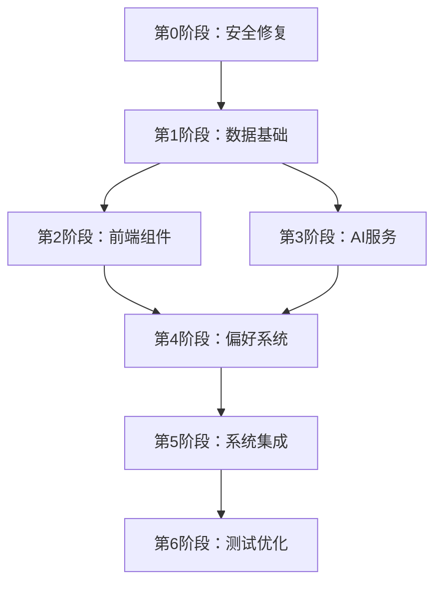

# 法考助手学习计划功能开发阶段

> 基于设计文档和流程图制定的完整开发计划
> 
> 文档版本：V1.0
> 创建时间：2025年6月20日

---

## 🚨 第0阶段：安全修复（优先级：紧急）
**⚠️ 必须先解决安全问题，否则拒绝继续开发！**

### 0.1 凭据安全化
- [ ] 将所有数据库密码移到环境变量
- [ ] DeepSeek API密钥移到.env文件
- [ ] 检查git历史，确保敏感信息未提交
- [ ] 创建.env.example模板

### 0.2 访问控制
- [ ] 为学习计划API添加用户认证检查
- [ ] 实现用户数据隔离机制

**完成标准**：所有敏感信息从代码中移除，环境变量配置完成

---

## 📋 第1阶段：数据基础设施（1-2天）

### 1.1 数据库扩展
- [ ] 扩展users表，添加学习偏好字段
- [ ] 创建user_preferences表存储用户偏好
```sql
CREATE TABLE user_preferences (
  id INT PRIMARY KEY AUTO_INCREMENT,
  user_id VARCHAR(255) NOT NULL,
  daily_hours INT DEFAULT 3,
  weekly_days INT DEFAULT 5,
  order_method ENUM('ai', 'manual') DEFAULT 'ai',
  learning_style VARCHAR(50),
  difficulty_preference VARCHAR(50),
  review_frequency VARCHAR(50),
  created_at TIMESTAMP DEFAULT CURRENT_TIMESTAMP,
  updated_at TIMESTAMP DEFAULT CURRENT_TIMESTAMP ON UPDATE CURRENT_TIMESTAMP
);
```
- [ ] 扩展study_plans表支持三级计划结构
- [ ] 创建plan_history表记录历史计划
- [ ] 添加数据库索引优化查询性能

### 1.2 API基础架构
- [ ] 创建`/api/study-plan/preferences/`偏好管理API
- [ ] 实现`/api/study-plan/generate/`计划生成API
- [ ] 创建`/api/study-plan/history/`历史查询API
- [ ] 添加冲突检测服务函数

**完成标准**：数据库结构完整，基础API能正常响应

---

## 🎨 第2阶段：前端核心组件（2-3天）

### 2.1 多步骤向导组件
- [ ] 创建`StudyPlanWizard`主组件
  - 位置：`components/learning-plan/study-plan-wizard.tsx`
  - 技术：Next.js 14 + TypeScript + Shadcn/ui
- [ ] 实现步骤1：科目进度选择组件
  - 8个法考科目的三状态选择（已完成/未开始/进行中）
- [ ] 实现步骤1.1：章节进度滑块组件
  - 垂直滑动进度条显示章节列表
  - 自动计算完成百分比
- [ ] 实现步骤2：科目排序组件（手动+AI）
  - 拖拽排序功能
  - AI智能排序选项
- [ ] 实现步骤3：时间设置组件
  - 每日学习时长选择（1-5h+）
  - 每周学习天数选择（3-7天）
- [ ] 实现步骤4：自定义说明组件
  - 文本输入框 + 引导词提示

### 2.2 计划展示组件
- [ ] 创建`PlanPreview`三级计划展示组件
- [ ] 实现总体规划思路展示
  - 当前进度分析
  - 学习目标设定
  - 学习策略说明
- [ ] 实现日计划展示组件
  - 时间安排详细展示
  - 学习内容和功能使用建议
- [ ] 实现周计划展示组件
  - 章节组合和里程碑
  - 复习安排
- [ ] 添加反馈输入和重新生成功能

**完成标准**：完整的向导流程，三级计划清晰展示

---

## 🤖 第3阶段：AI智能服务（2天）

### 3.1 智能排序算法
- [ ] 实现基于用户进度的排序权重计算
  - 进度权重60%：优先安排进度多的科目
- [ ] 添加科目重要程度权重系统
  - 重要程度25%：民法、刑法 > 行政法、诉讼法 > 其他
- [ ] 实现难易程度评估算法
  - 难易程度10%：优先安排较难科目
- [ ] 添加科目关联性分析
  - 关联性5%：相关科目连续安排

### 3.2 计划生成优化
- [ ] 设计三级计划生成的专用Prompt
```javascript
const generatePlanPrompt = `
基于用户数据生成法考学习计划，必须包含：
1. 总体规划思路（学习策略+目标设定+方法论）
2. 今日学习计划（时间安排+内容+功能建议）
3. 本周学习计划（章节组合+里程碑+复习）

用户数据：${JSON.stringify(userData)}
确保计划具体可执行，整合网站功能使用建议...
`;
```
- [ ] 实现基于用户偏好的个性化Prompt
- [ ] 添加计划一致性检查算法
- [ ] 优化AI响应时间和质量

**完成标准**：AI能生成高质量的三级结构计划

---

## 🔄 第4阶段：用户偏好系统（1-2天）

### 4.1 偏好记忆机制
- [ ] 实现用户选择自动保存
  - 每个步骤完成时自动保存到user_preferences
- [ ] 添加历史偏好预填充功能
  - 页面加载时自动填充历史选择
- [ ] 创建学习习惯分析算法
  - 分析用户的时间偏好、科目偏好等
- [ ] 实现表现数据收集
  - 记录计划完成率、学习时长等

### 4.2 冲突检测机制
- [ ] 实现进度冲突检测
  - 确保新计划基于最新学习进度
- [ ] 添加时间合理性检查
  - 避免超出用户历史最大承受能力
- [ ] 实现内容衔接验证
  - 保证知识点学习的连贯性
- [ ] 添加难度适配调整
  - 根据历史完成情况动态调整

**完成标准**：用户体验连贯，计划生成智能化

---

## 🔗 第5阶段：系统集成（1天）

### 5.1 功能整合
- [ ] 将学习计划集成到主导航
  - 更新`main-nav.tsx`添加学习计划入口
- [ ] 实现与AI问答的联动
  - 在AI聊天中推荐学习计划相关功能
- [ ] 添加与知识导图的关联
  - 学习计划中链接相关知识点
- [ ] 集成题库练习推荐
  - 根据学习进度推荐对应练习题

### 5.2 状态管理
- [ ] 创建学习计划Zustand store
```typescript
interface StudyPlanStore {
  currentPlan: StudyPlan | null;
  userPreferences: UserPreferences;
  planHistory: StudyPlan[];
  setCurrentPlan: (plan: StudyPlan) => void;
  updatePreferences: (prefs: UserPreferences) => void;
}
```
- [ ] 实现计划数据持久化
- [ ] 添加离线模式支持

**完成标准**：功能完整集成，用户体验流畅

---

## 🧪 第6阶段：测试与优化（1天）

### 6.1 功能测试
- [ ] 完整流程用户体验测试
  - 从问卷填写到计划确认的完整流程
- [ ] 多次生成计划一致性验证
  - 相同输入应产生一致的结果
- [ ] API性能和错误处理测试
  - 压力测试和异常情况处理
- [ ] 跨设备兼容性测试
  - 桌面端、移动端响应式适配

### 6.2 性能优化
- [ ] 数据库查询优化
  - 添加必要的索引，优化复杂查询
- [ ] 前端组件渲染优化
  - 使用React.memo，避免不必要的重渲染
- [ ] AI服务响应时间优化
  - 缓存常用计划模板
- [ ] 内存使用优化
  - 清理不必要的状态数据

**完成标准**：功能稳定，性能良好，用户体验优秀

---

## 📊 阶段依赖关系



---

## ⏱️ 时间估算

| 阶段 | 预计时间 | 并行可能性 |
|------|----------|------------|
| 第0阶段：安全修复 | 0.5天 | 独立进行 |
| 第1阶段：数据基础 | 1-2天 | 独立进行 |
| 第2阶段：前端组件 | 2-3天 | 可与第3阶段并行 |
| 第3阶段：AI服务 | 2天 | 可与第2阶段并行 |
| 第4阶段：偏好系统 | 1-2天 | 依赖前面阶段 |
| 第5阶段：系统集成 | 1天 | 依赖前面阶段 |
| 第6阶段：测试优化 | 1天 | 独立进行 |

**总计：7-10天完整开发**

---

## 🔧 技术要求

### 环境要求
- Node.js 18+
- MySQL 5.7.18+
- DeepSeek API Key

### 开发规范
- TypeScript严格模式
- ESLint + Prettier代码格式化
- 组件命名使用PascalCase
- API路由使用kebab-case
- 数据库字段使用snake_case

### 测试标准
- 单元测试覆盖率 > 80%
- API响应时间 < 2秒
- 前端组件加载时间 < 1秒
- 数据库查询优化，避免N+1问题

---

## 📝 交付物清单

### 数据库
- [ ] 扩展的数据库表结构
- [ ] 数据库迁移脚本
- [ ] 数据库索引优化脚本

### 后端API
- [ ] 学习计划生成API
- [ ] 用户偏好管理API
- [ ] 计划历史查询API
- [ ] 冲突检测服务

### 前端组件
- [ ] 多步骤问卷向导
- [ ] 三级计划展示组件
- [ ] 用户偏好设置页面
- [ ] 状态管理Store

### 文档
- [ ] API接口文档
- [ ] 组件使用文档
- [ ] 部署指南
- [ ] 用户使用手册

---

## ⚠️ 风险控制

### 高风险项
1. **安全问题**：必须优先解决，否则停止开发
2. **AI服务稳定性**：需要添加降级策略
3. **数据库性能**：大量用户时的查询优化

### 应对措施
- 安全问题零容忍，立即修复
- AI服务添加重试和缓存机制
- 数据库查询添加索引和连接池优化
- 前端添加Loading状态和错误处理

---

## 📈 成功指标

### 功能指标
- [ ] 用户能完成完整的学习计划制定流程
- [ ] 生成的计划结构清晰（总体+日+周）
- [ ] 用户偏好能正确保存和应用
- [ ] 计划生成时间 < 30秒

### 体验指标
- [ ] 页面加载时间 < 3秒
- [ ] 用户操作流畅，无明显卡顿
- [ ] 错误提示友好，用户能理解
- [ ] 移动端适配良好

### 技术指标
- [ ] 代码覆盖率 > 80%
- [ ] API响应时间 < 2秒
- [ ] 数据库查询优化完成
- [ ] 安全扫描通过

---

**开发准则：安全第一，用户体验至上，代码质量保证！**